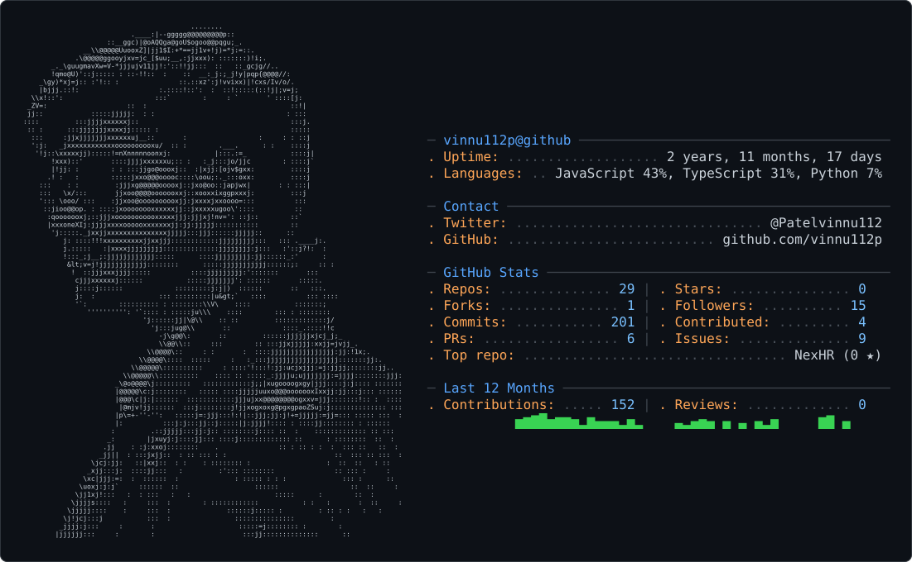
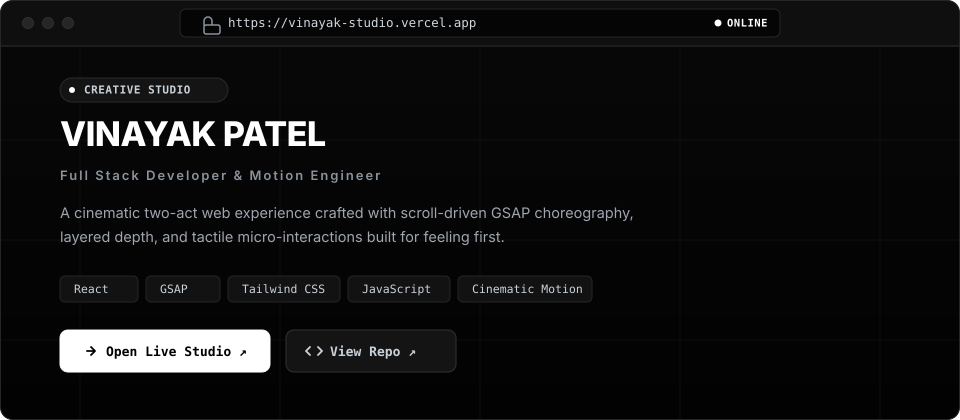

<!-- ─────────── HERO: ASCII portrait + details (built by build_hero.py) ─────────── -->

  

<!-- 
  ALTERNATIVE: Default gh.crafter.run dual-theme card with live auto stats.
  If you ever want to use the raw gh.crafter.run card instead of hero.svg, comment out hero.svg above and uncomment this:

  <picture>
    <source media="(prefers-color-scheme: dark)" srcset="dark_mode.svg" />
    <source media="(prefers-color-scheme: light)" srcset="light_mode.svg" />
    
  </picture>

-->

  

 

<h2 align="center">[ 01 ] &nbsp;ABOUT</h2>

> I'm drawn to websites that feel alive — fluid motion, subtle depth, and intentional micro-interactions that make software a joy to touch. While I don't claim to be a formal designer, I care deeply about how an interface feels the moment someone clicks, scrolls, or transitions between states.
> 
> To me, robust engineering and visual craftsmanship aren't separate worlds — they belong together. Every project below is a rep toward mastering that balance and building software that respects both function and feel.

<h2 align="center">[ 02 ] &nbsp;FEATURED PROJECTS</h2>

<!-- ROW 1: Featured Live Portfolio Mockup Window -->

  

<!-- ROW 2: NexHR, GoalFlow, AlgoPush in 3-Column Layout -->
<table width="100%">
<tr>
<td width="33.3%" valign="top">

### &nbsp; NexHR
**Enterprise HR Platform**

Unified workflow platform consolidating employee lifecycle, multi-role dashboards, attendance, and leave management.

- Full-stack production build
- Modular role-based UI

 

</td>
<td width="33.3%" valign="top">

### &nbsp; GoalFlow
**Role-Based Goal Tracker**

Granular goal management system with isolated dashboards and permissions tailored for Admins, Managers, and Members.

- Granular role permissioning
- Real-time progress updates

 

</td>
<td width="33.3%" valign="top">

### &nbsp; AlgoPush
**DSA Practice Engine**

Problem-solving tracker and workflow tool designed around competitive programming routines and disciplined spaced repetition.

- Organized problem logs
- Custom practice routine

 

</td>
</tr>
</table>

<h2 align="center">[ 03 ] &nbsp;TECH STACK</h2>

<!-- Languages -->

<!-- Frontend -->

<!-- Backend & Cloud -->

<!-- Tools -->

<h2 align="center">[ 04 ] &nbsp;PROBLEM SOLVING</h2>

<h2 align="center">[ 05 ] &nbsp;GITHUB STATS</h2>

<table border="0" cellspacing="0" cellpadding="6">
<tr>
<td valign="top" align="center" width="55%">

</td>
<td valign="top" align="center" width="45%">

</td>
</tr>
</table>

<h2 align="center">[ 06 ] &nbsp;CONTRIBUTIONS</h2>

<picture>
  <source media="(prefers-color-scheme: dark)" srcset="https://raw.githubusercontent.com/vinnu112p/vinnu112p/output/github-contribution-grid-pacman-dark.svg" />
  <source media="(prefers-color-scheme: light)" srcset="https://raw.githubusercontent.com/vinnu112p/vinnu112p/output/github-contribution-grid-pacman.svg" />
  
</picture>

 

 

